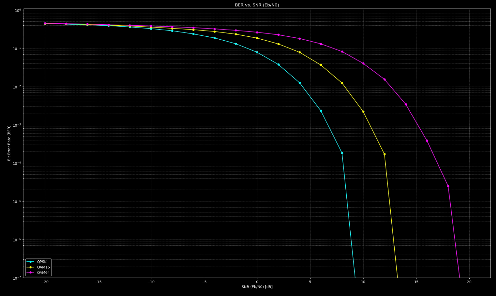

# QAM (QPSK, QAM16, QAM64) Modulator/Demodulator 




## L1 (физический уровень), Вариант 1
1. Написать на языке С++ класс, выполняющий функциональность модулятора QAM (QPSK, QAM16, QAM64)

2. Написать на языке С++ класс, выполняющий функциональность добавления гауссовского шума к созвездию QAM

3. Написать на языке С++ класс, выполняющий функциональность демодулятора QAM (QPSK, QAM16, ОАМ64)

4. Написать последовательный вызов 1-3 для случайной последовательности бит для разных значений дисперсия шума

5. Построить график зависимости вероятности ошибки на бит от дисперсии шума

---

График выше показывает зависимость Вероятности Ошибки на Бит от дисперсии шума для разных типов модуляции.
*   BER растет с увеличением шума для всех типов модуляции.
*   При одинаковом шуме, модуляции более высокого порядка (QAM64 > QAM16 > QPSK) имеют бОльшую вероятность ошибки. Это ожидаемая плата за передачу большего количества бит на символ.
*   QPSK показывает наилучшую помехоустойчивость, QAM64 - наихудшую.

## Сборка и Запуск

1.  **Сборка C++ кода:**
    Откройте терминал в корневой директории проекта и выполните:
    ```bash
    mkdir build
    cd build
    cmake ..
    make
    ```

2.  **Запуск C++ симуляции:**
    (Находясь в директории `build`)
    ```bash
    ./simulation
    ```
    Эта команда запустит симуляцию для QPSK, QAM16, QAM64 для разных уровней шума и создаст файл `simulation_results.csv` в директории `build`.

3.  **Построение графика (Python):**
    ```bash
    cd ../scripts
    python plot_ber.py
    ```
    Скрипт прочитает данные из `../build/simulation_results.csv` и отобразит график BER.